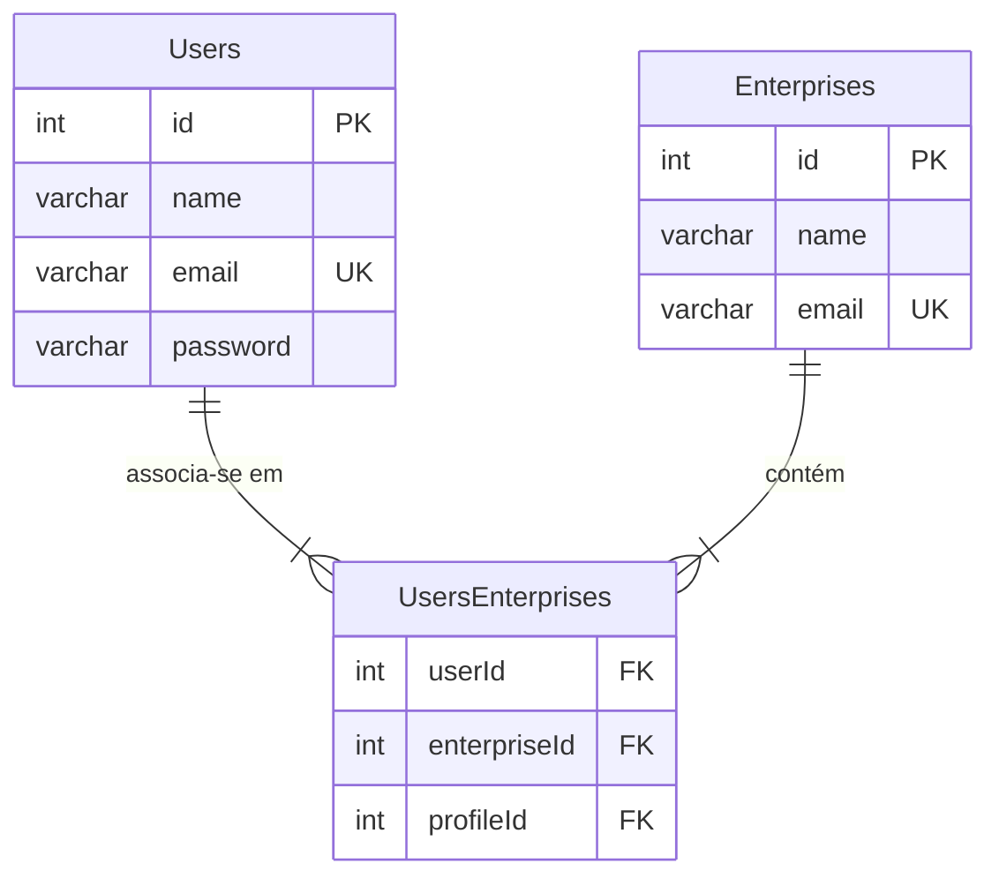

# Usuários e Empresas

Este documento tem como objetivo ilustrar as regras de negócio entre _Usuários_ e _Empresas_.

## Relacionamentos no Banco de Dados

### Componentes do Diagrama

#### Entidades (Tabelas)

    Users
        Propósito: Armazena as informações de cada conta de usuário individual na plataforma.
        Atributos:
            id PK: Chave Primária (Primary Key), um identificador numérico único para cada usuário.
            name: O nome do usuário.
            email UK: O endereço de e-mail do usuário, que funciona como uma Chave Única (Unique Key) para garantir que não haja dois usuários com o mesmo e-mail.
            password: O hash da senha do usuário, para armazenamento seguro.
    Enterprises
        Propósito: Armazena os dados de cada empresa ou organização cadastrada no sistema.
        Atributos:
            id PK: Chave Primária, um identificador numérico único para cada empresa.
            name: O nome da empresa.
            email UK: O e-mail de contato principal da empresa, também definido como Chave Única para evitar duplicidade.
    UsersEnterprises (Tabela de Associação / "Junction Table")
        Propósito: Esta é a tabela central que efetivamente cria o relacionamento Muitos-para-Muitos. Cada linha nesta tabela representa uma única ligação entre um usuário e uma empresa.
        Atributos:
            userId FK: Chave Estrangeira (Foreign Key) que se refere ao id da tabela Users.
            enterpriseId FK: Chave Estrangeira que se refere ao id da tabela Enterprises.
            profileId FK: Chave Estrangeira que aponta para um perfil ou papel. (Veja a observação abaixo).

### Relacionamentos

    Users <-> Enterprises (Muitos-para-Muitos)
        O relacionamento é definido pelas conexões das tabelas Users e Enterprises com a tabela de junção UsersEnterprises.
        Users ||--|{ UsersEnterprises: Um usuário pode estar associado a uma ou mais entradas na tabela UsersEnterprises, permitindo que ele pertença a várias empresas.
        Enterprises ||--|{ UsersEnterprises: Uma empresa pode conter uma ou mais entradas na tabela UsersEnterprises, permitindo que ela tenha vários usuários.

### Observação Importante: O Campo profileId

É crucial notar que a tabela UsersEnterprises contém um campo profileId como Chave Estrangeira (FK). No entanto, a tabela Profiles correspondente não está visualmente representada neste diagrama específico.

A presença deste campo é ligada a uma tabela chamada Profiles, que é responsável por dar diferentes funções para os usuários.

Este campo estar ligado a tabela de junção(Users) significa que o usuário pode ter diferentes cargos em diferentes organizações/empresas.
